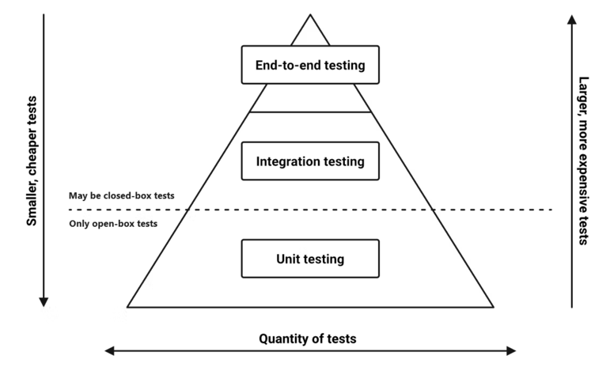
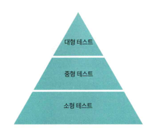

# 13. 테스트 피라미드

- 각 계층의 면적은 시스템에서 해당 유형의 테스트가 얼마나 분포돼야 하는지 표현
- 단위 테스트가 가장 많아야함

## 분류
- 단위 테스트
  - 소프트웨어를 구성하는 가장 작은 단위를 검증
  - Unit == 함수, 메서드, 클래스
  - 객체나 컴포넌트에 할당된 책임이 예상대로 동작하는지 테스트
- 통합 테스트
  - 여러 컴포넌트나 객체가 협력하는 상황을 검증
  - 객체들의 협력이 제대로 이뤄지는지 평가
- E2E 테스트 (= API 테스트, UI 테스트)
  - 실제 사용자 시나리오에서 시스템이 어떻게 동작하는지 검증
  - 하위 컴포넌트를 모두 구동한 뒤 API를 호출하는 방식으로 테스트

## 단위 테스트를 많이 만들어야하는 이유
- 테스트 비용이 적게 듦
- 빠르게 테스트를 수행할 수 있음
- 사이드 이펙트가 발생하는 범위가 경우의 수를 줄일 수 있음

## 테스트 피라미드의 단점
- 용어가 주는 모호함 때문에 테스트를 정확하게 분류하지 못함

# 13.1 구글의 테스트 피라미드

## 분류
테스트의 크기에 따라 분류
- 소형 테스트
  - 단일 서버, 단일 프로세스, 단일 스레드에서 동작
  - 디스크 I/O, 블로킹 호출이 없음
- 중형 테스트
  - 단일 서버에서 동작
  - 멀티 프로세스, 멀티 스레드 사용 가능
- 대형 테스트
  - 멀티 서버에서 동작

# 13.2 테스트 분류 기준
- 테스트가 결정적인가?
- 테스트의 속도가 빠른가?

## 결정성
- 결정적 == 일관된
- 테스트는 항상 같은 응답을 해야한다.

### 비결정적인 테스트
- 똑같은 테스트를 실행하더라도 항상 동일한 결과를 보이지 않는 테스트
- 비결정적인 테스트가 만들어지는 이유
  - 테스트가 병렬 처리를 사용할 경우
  - 테스트가 디스크 I/O를 사용할 경우
  - 테스트가 다른 프로세스와 통신할 경우
  - 테스트가 외부 서버와 통신할 겨웅

### 비결정적인 테스트는 어떤 결과를 불러오는가?
- 테스트의 신뢰도를 떨어뜨림
- 테스트 실패 상황을 재현하기 어려움
- 버그를 수정한 후에도 제대로 수정했음을 보장하기 어려움
-> 그래서 테스트는 결정적이어야한다.

## 속도
- 테스트 코드가 효과적이려면 테스트 코드를 자주 실행해야함
- 자주 실행하려면 테스트 코드 실행 속도가 빨라야함
- 속도가 느린 테스트가 만들어지는 이유
  - 테스트가 블로킹 호출을 사용할 경우
  - 테스트가 디스크 I/O를 사용할 경우
  - 테스트가 다른 프로세스와 통신할 경우
  - 테스트가 외부 서버와 통신할 경우

# 13.3 소형 테스트의 중요성
- 소형 테스트는 빠르고 결정적임 
- 소형 테스트를 작성하다보면 트랜잭셔널 스크립트 코드가 나올 확률이 줄어듬
- 애플리케이션 서비스의 테스트 -> 중형 테스트가 될 확률이 높음
  - 서비스에 있는 비즈니스 로직을 도메인으로 옮겨옴 -> 소형 테스트

> JPA에 의존한 테스트 코드를 작성하는 것을 피하고 순수 자바 코드로 작성하여 테스트 범위를 축소 시켜야한다. 하지만 순수 자바 코드로 작성하면 JPA의 이점은 누릴 수가 없는데 과연이게 맞는가? 

