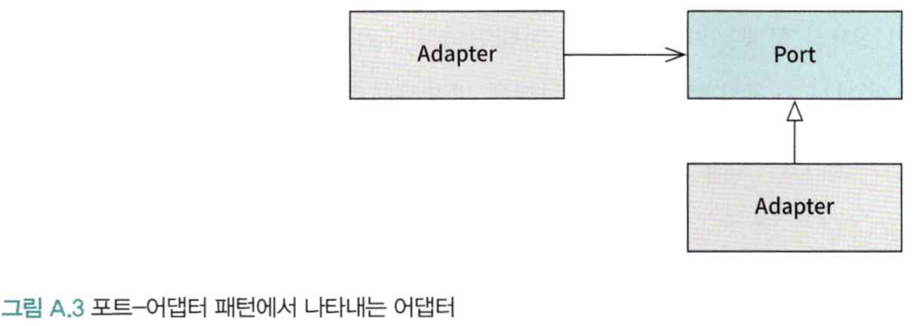
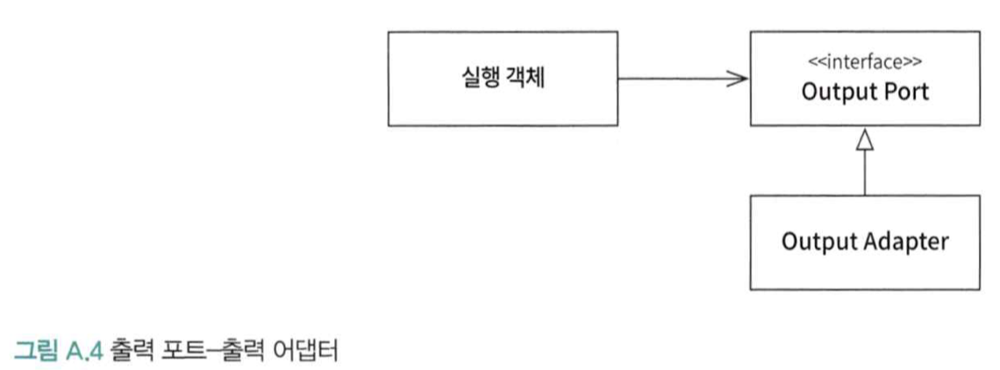
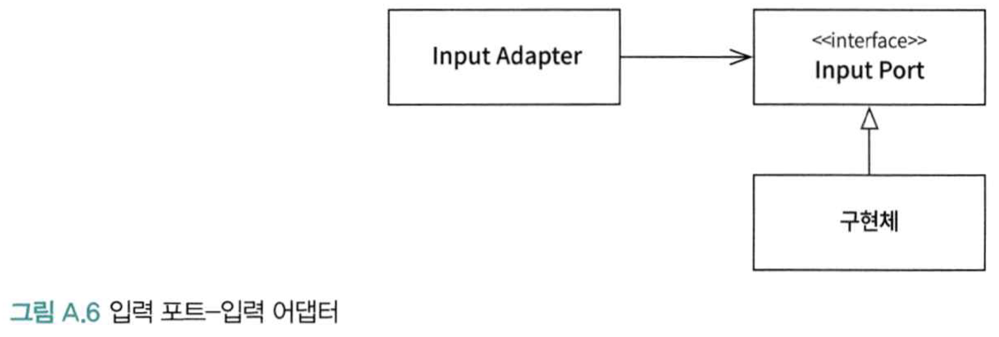
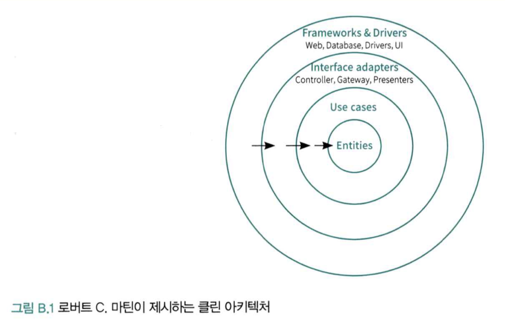

# 포트-어댑터 패턴
- 두 시스템이 상호 작용할 때 가운데 추상적인 개념(인터페이스)를 두고 통신하도록 만듦
  - 시스템간의 종속을 완화
- 포트를 구현하는 객체만 `Adapter`인 것이 아닌, 사용하는 객체도 `Adatper`로 볼 수 있음

- 출력 포트 - 출력 어댑터

- 입력 포트 - 입력 어댑터 

# 클린 아키텍처

- `Entities`
  - 시스템의 비즈니스 로직과 객체를 정의
  - 외부의 영향을 받지 않고, 가장 변하지 않아야 함
- `Use Cases`
  - 비즈니스 흐름과 엔티티 간의 상호작용을 관리
  - 사용자의 요청을 처리하고 그에 따라 엔티티를 조작
- `Interface Adapters`
  - 외부 인터페이스와 `Use Cases`를 연결하는 역할
  - 외부의 요청을 내부 형식으로 변환 하거나 내부의 데이터를 외부 형식으로 변환
- `Frameworks & Drivers`
  - 시스템의 외부와 상호 작용
- 클린 아키텍처는 시스템의 경계를 나누고, 경계의 방향을 "단방향성"으로 강조
- 클린 아키텍처는 "구현"에 대한것이 아니고, "개념"적인 인터페이스
  - 헥사고날 아키텍처
  - 양파 아키텍처

# 소프트웨어 엔지니어
- 프로그램의 기대 수명은 여러가지 요소에 의해 결정됨
- 시간이라는 변수는 시스템을 지속하기 어렵게 만드는 주요 원인
- 만드는 시스템이 어떤 기대 수명을 가질지 고려하여, "시간", "확장", "트레이드오프"라는 세 가지 개념까지 생각해야 "엔지니어"라고 얘기할 수 있음 (구글)
  - 코더 > 프로그래머 > 엔지니어

# 실용주의
- 비즈니스 가치를 전달하기 위한 도구가 반드시 "소프트웨어"일 필요는 없음
  - 오프라인에서의 해결도 방안들도 존재
  - 비즈니스적으로 풀어나갈수도 있음
- 소프트웨어는 다양한 형태로 개발될 수 있고, "비즈니스 가치 전달"이란 목표를 망각하면 안됨
- 프로젝트는 장기로 이루어 질지, 단기로 끝날지 불확실 -> 적용 전 트레이드 오프를 고려