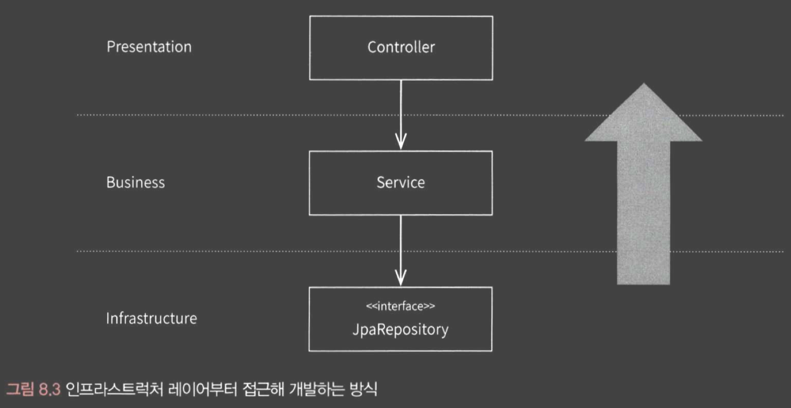
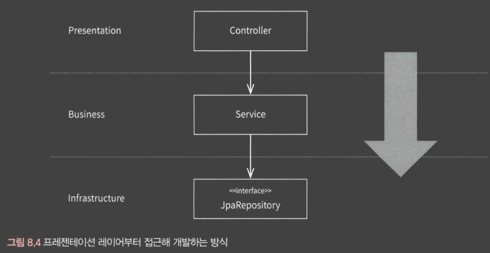
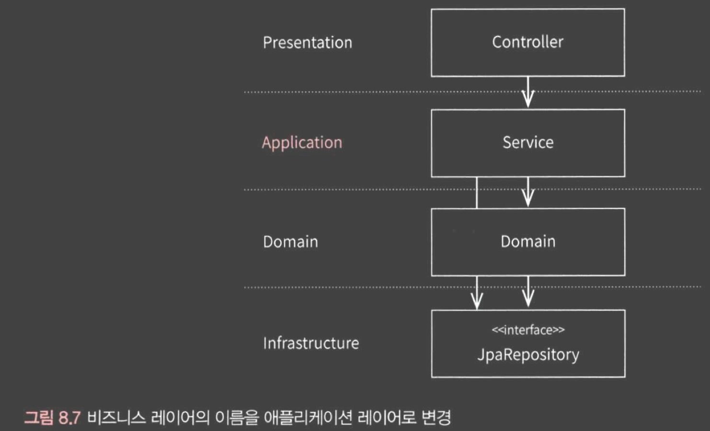
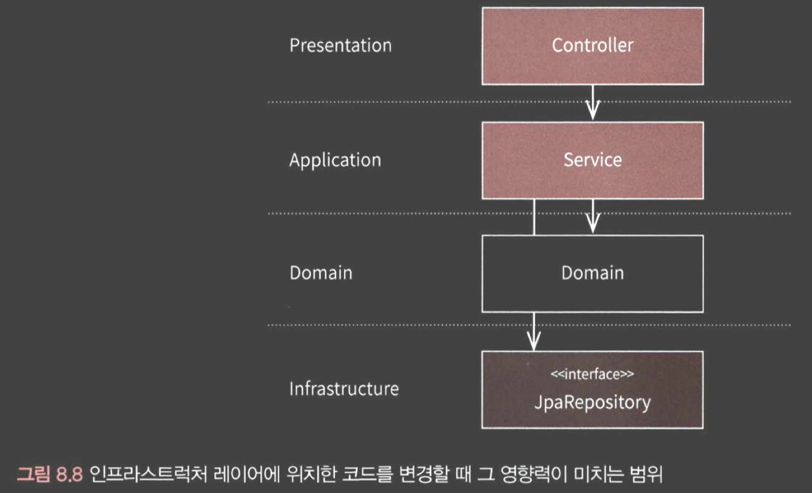
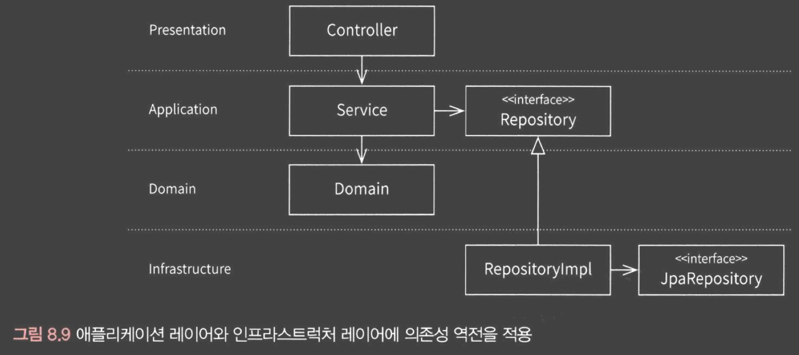
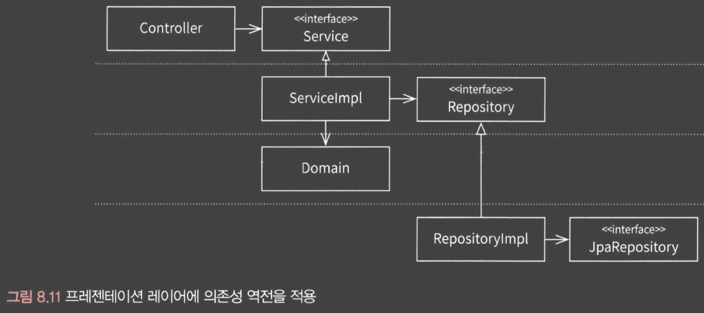
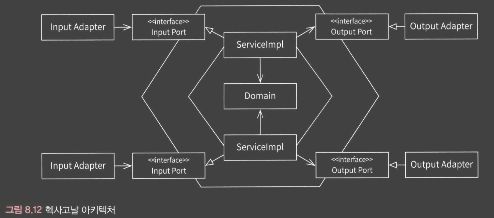
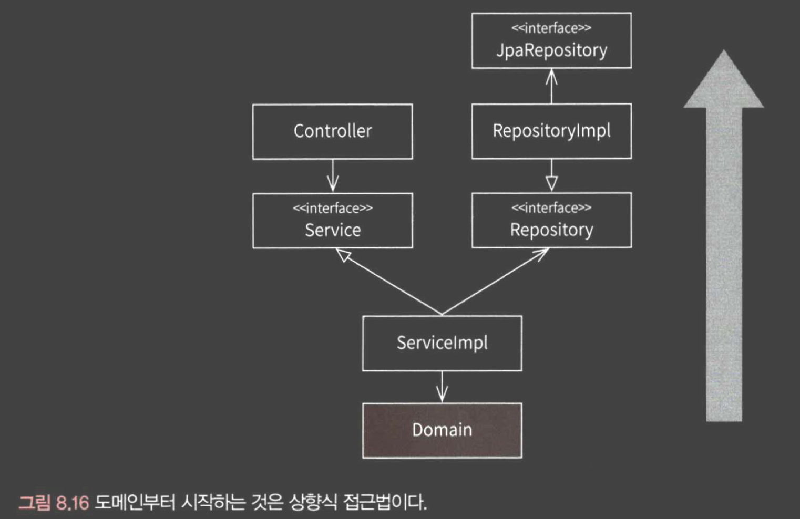

## 8-1. 레이어드 아키키텍처의 최소 조건
### 아키텍처
- 아키텍처는 정책과 제약 조건을 이용해 목적을 달성한다.
- 제약들을 통해 개발의 방향성을 만들어 나아간다.
- "형태"가 아니라 "정책"에 가깝다.
> 레이어드 구조가 아닌 레이어드 아키텍처로써 사용하려면, 제약 조건을 이해하고 사용해야 한다.

### 레이어드 아키텍처의 제약 조건
- (필수) 레이어 구조를 사용한다.
- (필수) 레이어 간 의존 방향은 단방향으로 유지한다.
- 레이어 간 통신은 인접한 레이어에서만 이뤄지게 한다.

## 8-2. 잘못된 레이어드 아키텍처
- 서버에 기능을 추가할 때, 아래와 같은 방법은 올바른 접근이 아닐 수 있다.
### JPA 엔티티 우선 접근
- `Entity`를 통해 접근하게 되면, 객체지향스럽게 되지 않을 확률이 높다.
- `Entity` 우선 접근은 데이터베이스 위주의 사고를 하게 되고, 상향식 접근이다.

> JPA 엔티티 우선 접근은 테이블의 관계에 대해 먼저 고려하게 되어 도메인에 대한 사고의 자율성을 저해할 수 있다.

### API 엔드포인트 우선 접근
- 프로젝트가 스프링 프레임워크에 종속될 수 있다.
- 순수한 도메인이 구성되기 보다는, 엔드포인트에 따라 도메인이 맞춰지게 될 가능성이 크다.

### 어떻게 접근 할 것인가
- 특정 기술에 종속되지 않는 순수한 도메인
- 객체지향적인 POJO로 도메인을 만들어야 한다.
- 세부 사항(`Spring`, `JPA` 등)에 대한 결정은 최대한 뒤로 미룬다.

## 8-3. 진화하는 아키텍처
### 인지 모델 변경하기
- 비즈니스 레이어
  - 애플리케이션(서비스) + 도메인
  - 
- 도메인을 개발하려면, "비즈니스 레이어"부터 개발을 시작하는 것이 좋다.
  - POJO로 개발한다.
  - 최대한 특정 기술, 외부 라이브러리에 의존되지 않도록 개발한다.
- 도메인을 우선 개발하고, `Spring`이나 `JPA` 같은 기술을 추가 해 나아간다.
  - `Domain`과 `Entity`간 "매핑 메서드"를 통해 변환한다.

### JPA와의 결합 끊기
- Application이 JpaRepository를 바로 의존하게되면, JPA 코드 변경에 따른 영향이 이를 참조하는 모든 상위 레이어에 전파되게 된다.

- "의존성 역전"을 통해 레이어간 결합을 느슨하게 만들 수 있다.

### 웹 프레임워크와의 결합 끊기

- 결국 이는 "헥사고날 아키텍처"와 유사하게 된다.
  - 헥사고날 아키텍처는 도메인을 외부와 완전히 독립적으로 동작하게 만든다.
  - 
  - 의존성 역전의 또 다른 이름이 "포트-어댑터" 패턴이다.

> POJO 도메인 + 의존성 역전을 통해 "순수한" 비즈니스 레이어를 만드는 것을 이야기하고 있다.

## 8-4. 새로운 접근법
- 도메인부터 접근하는 개발 방식은 상향식 방식이다.

## 8-5. 빈약한 도메인
- 빈약한 도메인은 경쟁력이 없고, 성공하더라도 복잡한 요구사항을 받아들일 수 없게 된다.
- 정답은 없고, 항상 적절한 Trade-Off를 고려해야 한다.
