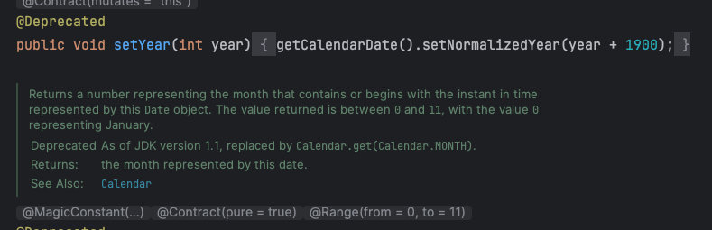
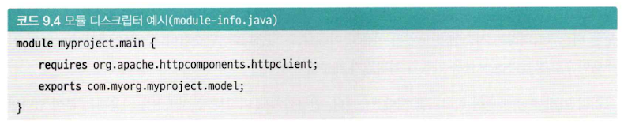
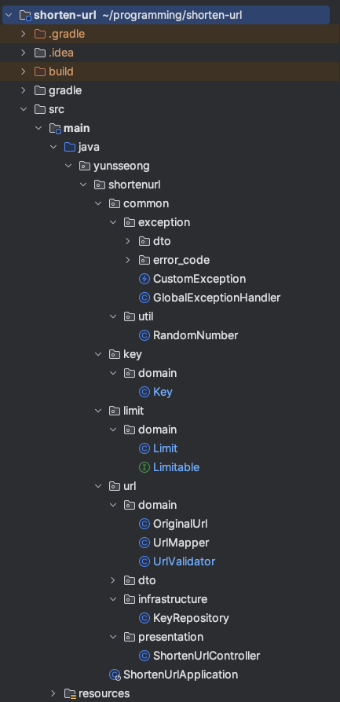

# 9.1 모듈성
## 소프트웨어 관점에서 모듈
독립성과 은닉성을 가진 유사한 기능의 코드 집합
### 독립성
- 모듈은 독립적이어야 한다.
- 각 모듈을 개별적으로 수정하거나 교체할 수 있어야함
- 유지보수 용이하게 하고, 확장성을 높이고, 코드 재사용성을 높이기 위함
- 외부 시스템을 사용한다면 외부 시스템의 사용을 명시해야한다.
### 은닉성
- 모듈은 사용자는 모듈의 내부 구현을 몰라도 된다.
- 은닉성을 통해서 외부로 노출되는 기능을 최소화할 수 있음
- 모듈 내부 구현이 변경되어도 영향을 최소화할 수 있음

이 둘을 묶어서 **모듈성**이라고 한다.
> 독립성과 은닉성은 모듈이 되기 위한 필요 조건이다. 

### 은닉성과 캡슐화
- 캡슐화 : 데이터와 행동을 묶어서 객체 단위로 모듈화
- 은닉성 : 내부 구현을 외부에 숨겨서 보호
- 캡슐화와 은닉성의 관계 : 캡슐화는 은닉성을 가능하게 하고, 은닉성은 캡슐화의 목적 중 하나

> 캡슐화를 제대로 하지 않으면 어떤일이 벌어질까?
### 캡슐화 실패 사례
#### java.util.Date 클래스
- 설계 초기에 캡슐화를 고려하지 않고 내부 필드를 우회적으로 조작할 수 있는 public setter를 메서드로 제공함
  

#### sun.* 패키지
- 내부 전용 API 였지만, 일부 라이브러리와 애플리케이션이 직접 참조하게 되면서 Public API 처럼 사용됨
- 캡슐화를 제대로 했다면 외부 접근이 불가능했어야하나, 실제로는 열려 있었음.

> 캡슐화를 제대로 지키지 않은 API는 추후 어떻게 처리될까?
- 자바는 하위 호환성을 중요시하기 때문에 API를 제거하진 않고 문제의 API를 deprecate 시키고 새로운 대안을 제공하는 방식으로 해결

### 모듈 시스템
모듈성을 갖출 수 있도록 도와주는 시스템
- 의존성 관리 : 모듈을 사용하기 위해 어떤 의존성이 필요한지 명시할 수 있어야함
- 캡슐화 관리 : 모듈은 불필요한 구현을 외부로 드러내지 않아야함

### 자바에서의 모듈 시스템
- 자바 9 버전부터 모듈 시스템인 모듈 디스크립터가 도입됨

https://www.oracle.com/kr/corporate/features/understanding-java-9-modules.html

### 자바의 패키지 시스템
- 모듈이라고 할 수 없음
- 패키지 수준의 의존성 관리와 캡슐화 관리 기능이 지원되지 않음

## 모듈과 라이브러리의 차이
- 라이브러리는 모듈의 집합
- 모듈이 가지는 특성인 독립성과 은닉성을 가지고 있음

--- 

# 9.2 패키지 구조
## 계층 기반 구조
- 최상단 패키지에 레이어드 아키텍처의 계층을 두고 해당 계층에 대응하는 컴포넌트를 아래에 넣는 방식
- 장점 : 패키지가 레이어드 아키텍처의 인지모델을 따르고 있음 -> 레이어드 아키텍처를 알면 쉽게 개발 가능
- 단점 : 도메인을 파악하기 힘듬
## 도메인 기반 구조
- 최상단 패키지에 프로그램이 사용하는 도메인이 오도록 구성
- 장점 : 비즈니스 코드가 각 도메인별로 모여있음
- 단점 : 계층 구조가 쉽게 파악이 안됨
## 도메인-계층 기반 구조
- 최상단은 도메인이 오고 하위에 계층 기반으로 패키지를 구성하는 방식
- 장점 : 도메인과 계층 구조가 비교적 쉽게 파악 됨
- 단점 : 복잡도가 증가함

## 패키지 구조를 선택하는 방법
- 상황에 따라 적합한 패키지 구조를 선택하면 됨
- 프로젝트의 추구 방향을 보고 판단

> 계층보다 도메인이 문제해결이라는 본질에 가깝다고 생각한다.
> 레이어드 아키텍처는 확장성과 유지보수성을 높이기 위한 수단이지
> 사용하지 않는다고 해서 문제를 해결하지 못하는 것은 아니다.
> 그렇기에 도메인이 중심이 되어 개발이 진행되어야한다.
> 도메인이 중심이 되어 개발을 하려면 최상단 패키지를 도메인을 하여 자연스럽게 도메인이 먼저 개발되도록 구성하는 것이 방향이 더 좋을 것이라 생각한다.
> 그리고 그 하위에 계층 기반 패키지 구조를 도입하여 계층 구조 또한 잘 파악할 수 있게 한다면 확장성과 유지보수성이 높아질 것이다.
> 결론적으로 우선 순위에 따라 패키지를 구성하는 "도메인-계층 기반 구조"가 도메인을 먼저 개발하게 하고 레이어드 아키텍처를 잘 지킬 수 있게 만들 것이다.